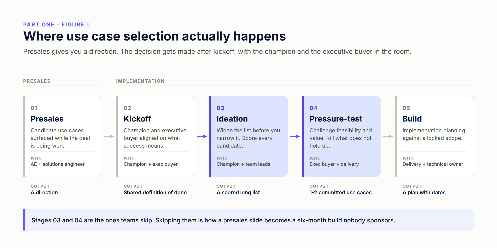
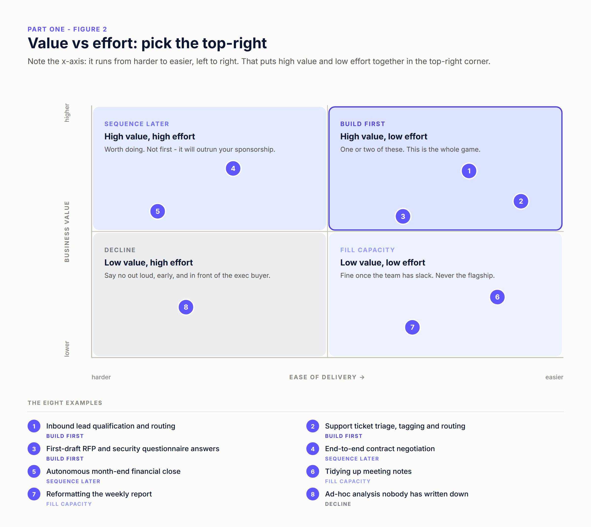
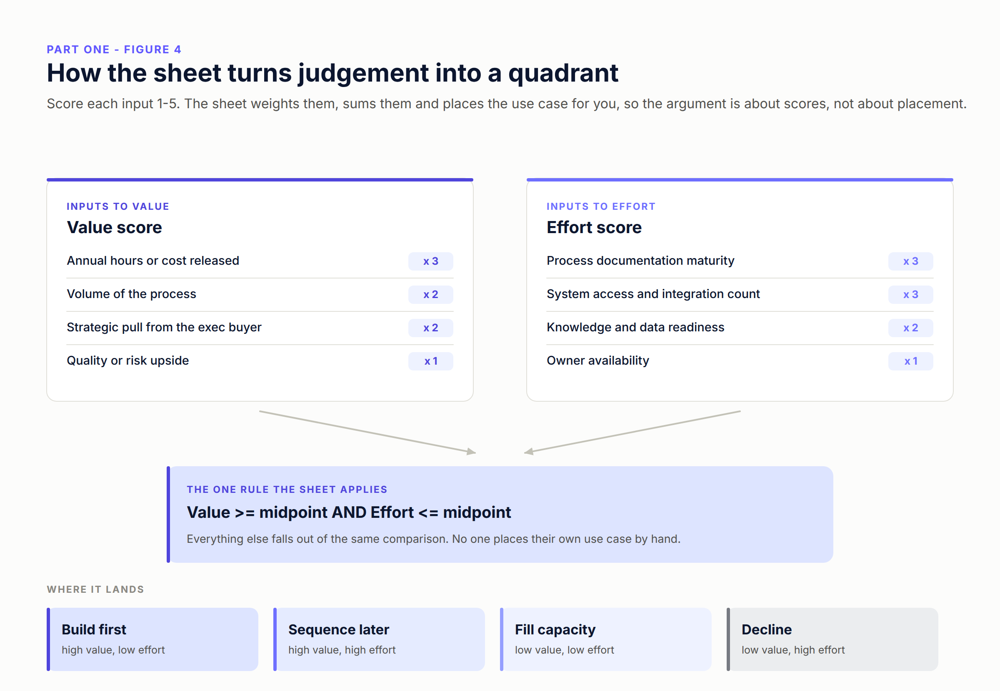
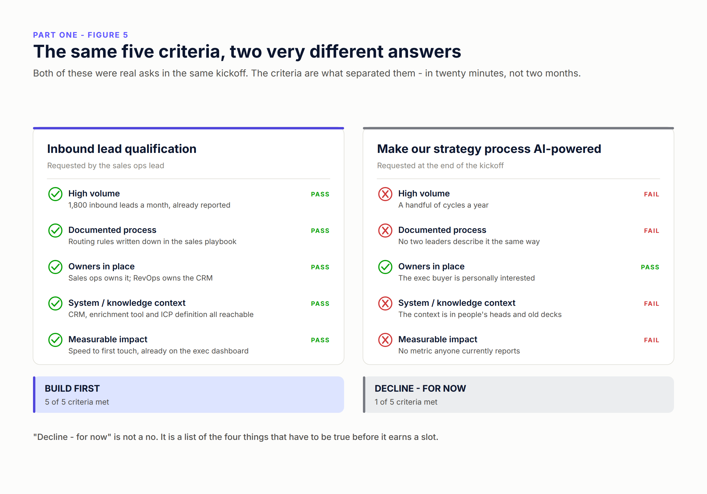
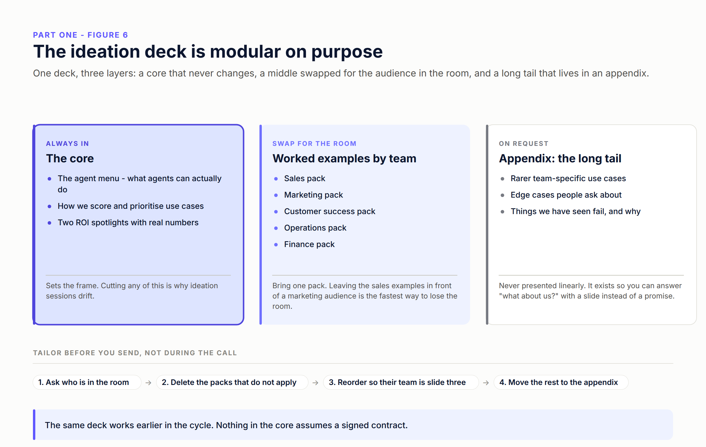

# Part One — What makes a use case good for Agentic AI

> **Series:** [Relevance AI — Agentic AI Series](../README.md) · **Part 1 of 3 (so far)**
> **Reading time:** ~14 minutes · **Level:** Beginner, no agent-building experience assumed
> **Companion asset:** [`build/use-case-scoring-sheet.xlsx`](./build/use-case-scoring-sheet.xlsx)

---

## The 90-second version

- The expensive mistake in agentic AI is almost never the build. It's the pick.
- Use case selection is **not** a presales handoff. Presales gives you a direction; the decision gets made after kickoff, with the champion and the executive buyer in the room.
- Plot every candidate on **value vs effort** and deliberately choose the top-right: high value, low effort. Not because it's ambitious, but because it's the only quadrant that produces proof before your sponsorship expires.
- A use case is high-probability when it clears **five gates**: high volume, a documented process, owners already in place, reachable system and knowledge context, and measurable business impact. All five. Not four.
- Score it in a shared sheet so the quadrant is calculated, not argued. Then make the champion and the exec buyer re-confirm the ranking in front of each other.
- Teach the customer to do this themselves with a **modular ideation deck** — a fixed core, an audience-swappable middle, and a long tail in the appendix.

---

## The expensive mistake isn't the build

I have watched teams ship a technically excellent agent that nobody wanted.

The pattern is consistent enough to be boring. Someone picks a use case that sounds impressive. Six or eight weeks disappear into building it. The demo works. And then it dies quietly, because the process it automated only ran eleven times a quarter, or because the person who was supposed to accept its output had never agreed to, or because nobody could say what number moved.

Nothing went wrong in the build. Everything went wrong before it.

This is what makes use case selection the highest-leverage twenty minutes in an agentic AI program. It is also the part most teams treat as already settled — because a slide from the sales cycle said so.

---

## Where use case selection actually happens

Presales produces a *direction*. That is genuinely useful — it means someone has already found the pain, and you are not starting from a blank page. But a direction is not a plan, and the slide that won the deal was written to win the deal.

So implementation planning starts by **taking the presales use cases as input and pressure-testing them** — on feasibility and on value, separately. Some survive intact. Some turn out to be three use cases wearing one name. Some quietly fail a gate nobody checked during the sales cycle, usually the documented-process one.

The pressure-test has to happen with the **champion and the executive buyer**, after kickoff, not in a delivery team's private planning doc. Two reasons:

**The champion knows where the bodies are buried.** They know that the "documented" process has three undocumented exceptions, that the system of record is not the system people actually use, and that the team who owns it is mid-reorg. None of that was in the deal.

**The executive buyer owns the sponsorship.** If they haven't personally re-confirmed the priority order, they haven't committed to defending it in eight weeks when someone asks why the team is spending time on this. Sponsorship that was never re-confirmed is sponsorship you don't have.

Stages 03 and 04 in the diagram are the ones that get skipped when a program is running late. Skipping them is precisely how a presales slide becomes a six-month build nobody sponsors.

### Why not just transform everything

There is a version of this conversation where the answer is "all of it" — rebuild how the company works, agents everywhere, top to bottom. It's an exciting conversation. It is also the single most reliable way to kill an agentic AI program.

Org-wide transformation fails for reasons that have nothing to do with the technology. It needs every team's attention at once, when each team has its own quarter to survive. It has no early proof point, so it burns political capital before it produces evidence. It touches enough systems that one access request can stall the whole thing. And it makes the program's first visible milestone a reorganisation, which is the least popular thing you can ask an organisation to look at.

Narrow, high-value, low-effort work does the opposite. It produces a result while people are still paying attention. That result is what buys the right to go wider.

---

## Value vs effort: why you want the top-right

**Read the x-axis carefully, because it is drawn deliberately.** It runs from *harder* on the left to *easier* on the right. That puts high value and low effort together in the top-right corner, which is where you want to be looking. If you've seen this grid with effort ascending to the right, the target moves to the top-left — same idea, mirrored. I draw it this way so "aim top-right" means one thing every time.

Four quadrants, four different answers:

**Top-right — build first. High value, low effort.** One or two of these. This is the whole game. Everything else in this article exists to help you find them.

**Top-left — sequence later. High value, high effort.** Real work, worth doing, and it will outrun your sponsorship if you start here. Write it down, put a date on revisiting it, and come back once you have a win to spend.

**Bottom-right — fill capacity. Low value, low effort.** Fine once the team has slack. Never the flagship. The danger with this quadrant is that it *feels* productive: things ship, demos happen, and six weeks later there is no business number to point at.

**Bottom-left — decline. Low value, high effort.** Say no out loud, early, and in front of the executive buyer. A quiet no becomes a resurrection three months later.

The reason to be this disciplined isn't tidiness. It's that **executive attention has a half-life**. From kickoff, you have a window in which the exec buyer is personally invested and will clear obstacles for you. Spend that window on something that can produce a result inside it, and you get a second window that is longer than the first. Spend it on a transformation, and you'll be explaining a Gantt chart to someone who has stopped attending.

---

## The five criteria

These are the five things I want to be true before I'll call a use case high-probability. They are **gates, not a weighted average**. A use case that clears four of five is not 80% ready — it has one specific, nameable hole, and naming it is far more useful than averaging it away.

### 1. High volume

**Ask:** how many times a week does this happen, and who counts it?

Volume is what turns a working agent into a business case. The arithmetic is unforgiving: an agent that saves twenty minutes on a task that runs forty times a year saves about thirteen hours annually. That is a demo. The same agent on a task that runs forty times a *day* is a different conversation entirely.

**What good looks like:** the team can state a weekly or monthly count without going to look it up, because someone already reports it.

**The failure mode:** low volume dressed up as high stakes. "It only happens a few times a year, but when it does it's critical" is often a real problem — it's just rarely an agentic one. High-stakes, low-frequency work usually wants a better checklist and a human.

### 2. A documented process

**Ask:** can you show me the SOP, the checklist, or a screen recording of someone doing it?

This is the gate that fails most often, and the one people most want to wave through. If the process only exists in someone's head, you are not automating a process. You are inventing one, on a deadline, while also building an agent — and you will end up doing organisational design disguised as engineering.

**What good looks like:** something written down that a new starter could follow. It doesn't have to be beautiful. It has to exist, and it has to match what people actually do.

**The failure mode:** two leaders describe the same process differently in the same meeting and nobody notices. When you hear that, stop. The use case isn't ready; a workshop to write the process down is the actual next step, and it's a week, not a quarter.

### 3. Owners already in place — business *and* technical

**Ask:** who owns this in the business, and who owns the systems it touches?

Two named people, both with time. The business owner accepts the output and is accountable for the metric. The technical owner opens the doors: system access, API credentials, the security review.

**What good looks like:** you can write both names down, and both people were in the room when the use case was picked.

**The failure mode:** an enthusiastic executive and nobody accountable underneath. Executive interest is necessary and it is not sufficient. Without a business owner, the agent's output has no home; without a technical owner, access requests sit in a queue for five weeks and the momentum you were protecting is gone.

### 4. System and knowledge context

**Ask:** what must the agent read in order to be right, and can we actually reach it?

Agents are only as good as their grounding. This gate is about naming the systems, documents, definitions and edge-case rules the agent needs, and confirming they exist somewhere retrievable — not in someone's head, not in a deck from 2023, not in a system nobody has credentials for.

**What good looks like:** a short list of sources, each with a named owner, each reachable.

**The failure mode:** an agent with no grounding does not fail loudly. It guesses, fluently and confidently, and people believe it. That is worse than no agent, and it is the failure that damages trust in the whole program rather than in one workflow.

### 5. Measurable business impact

**Ask:** what number moves, by how much, and who already reports it?

The "already reports it" is the load-bearing part. If proving the benefit requires inventing a new metric, establishing a baseline, and getting someone to own a dashboard, then the measurement project is bigger than the agent project — and at renewal the conversation becomes an argument about vibes.

**What good looks like:** an existing metric on an existing report, ideally one the executive buyer already looks at. Speed to first touch. First-response time. Days to close. Cost per invoice processed.

**The failure mode:** impact expressed only as "efficiency" or "time saved" with no baseline. Time saved is real, but if nobody measured the *before*, you cannot demonstrate the *after*.

### Say it plainly: five for five

Four out of five is not a green light. It's a named piece of work to do before the build starts — write the process down, find the technical owner, get the metric onto a report. Often that work is days, not months, and doing it first is what separates programs that compound from programs that stall.

---

## Turning judgement into a score

Everything above is judgement, and judgement in a workshop has a problem: the most senior voice wins, and nobody can reconstruct the reasoning two months later.

So put it in a shared sheet. Not because a number is truer than a conversation — because a number is **re-runnable, visible, and arguable in public**.

The model is deliberately simple. Score each input 1 to 5. The sheet weights them, sums them, normalises both totals to a 0–100 index, and applies one rule.

**Value inputs** — annual hours or cost released (×3), volume of the process (×2), strategic pull from the executive buyer (×2), quality or risk upside (×1).

**Effort inputs** — process documentation maturity (×3), system access and integration count (×3), knowledge and data readiness (×2), owner availability (×1).

Every effort input is scored so that **5 always means hardest**. The sheet flips the total into an *ease* index, so a high ease index means easy to deliver — which is what puts the good candidates in the top-right of the quadrant.

Then the only rule that matters:

> **Value index ≥ threshold AND ease index ≥ threshold → build first.**
> Everything else falls out of the same comparison.

Three things this buys you that a whiteboard does not:

**Nobody places their own use case.** The most common workshop failure is the sponsor of an idea deciding which quadrant it goes in. Take that away and you remove most of the politics.

**Disagreement becomes specific.** "I think that's low effort" is unarguable. "I scored system access a 2, you scored it a 5" is a conversation that resolves in ninety seconds, because one of you knows something the other doesn't. That is the whole value of the exercise.

**The ranking survives re-scoring.** Someone will say "what if the exec cares more about risk than hours?" Change the weight, watch the ranking move, and decide with the new order in front of you. Ten seconds, in the meeting.

The sheet in [`build/use-case-scoring-sheet.xlsx`](./build/use-case-scoring-sheet.xlsx) has four tabs: a **Read me** with the weights and thresholds as editable cells, a blank **Score use cases** tab, a **Worked example** with ten scored use cases, and a **Scoring guide** with concrete 1-to-5 anchors for every input. Those anchors matter more than they look — "high volume" is an argument, "between 500 and 2,000 hours a year" is a score two people can agree on.

---

## Two use cases, the same five criteria

Both of these came up in the same kickoff, twenty minutes apart.

**"Inbound lead qualification and routing"** came from the sales ops lead. Eighteen hundred leads a month, already reported. Routing rules written down in the sales playbook. Sales ops owns the outcome, RevOps owns the CRM. The CRM, the enrichment tool and the ICP definition are all reachable. Speed to first touch is already on the executive dashboard. Five for five.

**"Make our strategy process AI-powered"** came from the CEO at the end of the meeting. A handful of cycles a year. No two leaders describe the process the same way. The context lives in people's heads and old decks. No metric anyone currently reports. One for five — and the one it passes is "owners in place", on the strength of the CEO being personally interested.

The second one is more exciting. It is also, right now, undeliverable. And here is the part that matters: **the answer is not "no", it's "not yet, and here are the four things that have to be true first."** That reframing is the difference between declining a request and giving a CEO a roadmap. One of those makes you a partner.

---

## Running the ideation session

Selection is a meeting, and the meeting has a shape.

**Get the right room.** The champion, the executive buyer, and one lead from each function you might touch. If the exec buyer can only do twenty minutes, put them at the end — you want them re-confirming a ranking, not brainstorming.

**Widen before you narrow.** Ask every function for candidates before you score anything. You are looking for the use case nobody thought to put in the deal, and it is usually two levels down from the person who signed.

**Score live, in the sheet, on the screen.** Watching the ranking reorder as scores change does more to build shared understanding than any amount of explaining the framework.

**Re-confirm out loud.** Before anyone leaves: "we are building these one or two, we are revisiting these in the next quarter, and we are declining these." Get the exec buyer to say it. Write it down and send it that day.

**Time-box hard.** This is a ninety-minute meeting, not a two-day offsite. If it needs two days, the problem is that a process isn't written down — and that's a different meeting.

---

## Teaching the customer to fish: the ideation deck

You can run this exercise for a customer once. It's better if they can run it themselves, for the next team, without you. That's what the ideation deck is for — and building it as three layers rather than one deck is what makes it survive contact with a real audience.

**The core, always in.** The agent menu — what agents can actually do, in plain language, because most people's mental model is either a chatbot or a robot. How we score and prioritise. Two ROI spotlights with real numbers. Cut any of this and the session drifts into a wish list.

**The middle, swapped for the room.** Worked examples by team: a sales pack, a marketing pack, a customer success pack, an operations pack, a finance pack. Bring **one**. Leaving the sales examples in front of a marketing audience is the fastest way to lose a room — it reads as "we haven't thought about you", and everything after it is discounted.

**The appendix, on request.** The long tail: rarer team-specific use cases, the edge cases people ask about, and the things we've seen fail and why. Never presented linearly. It exists so that when someone asks "what about *our* team?", you answer with a slide instead of a promise.

Two more notes on the deck. **Tailor it before you send it, not during the call** — ask who's in the room, delete the packs that don't apply, reorder so their team is slide three, and move the rest to the appendix. And **nothing in the core assumes a signed contract**, which means the same deck works earlier in the cycle: in presales, or in a free-sales motion where you're trying to help someone see what's possible before they've committed to anything.

---

## Six ways this goes wrong

**The presales handoff.** Treating the deal-stage use case list as settled. It's an input, and it was written under different incentives.

**The transformation trap.** "Let's redesign how the company works." No early proof, every team's attention required at once, and the first visible milestone is a reorg.

**The undocumented process.** Building an agent for a process that doesn't exist in writing. You will end up doing process design under build-phase deadlines, badly.

**The orphan use case.** Executive enthusiasm, no business owner, no technical owner. The output has nowhere to go and access requests never clear.

**The vanity metric.** "Efficiency gains" with no baseline and no existing report. At renewal you'll have anecdotes where you needed a number.

**Boiling the list.** Twelve use cases in parallel because saying no felt impolite. Twelve half-built agents are worth less than one finished one, and they cost more.

---

## What to do this week

1. Write down every candidate use case you've heard, including the ones from presales. Aim for fifteen, not five — you narrow later.
2. Open [the scoring sheet](./build/use-case-scoring-sheet.xlsx) and answer the five gates for each. Y or N, no maybes.
3. Anything below five gates: write down the *specific* gap and who could close it. Most gaps are days of work.
4. Score value and effort for everything that clears all five, and let the sheet rank them.
5. Book ninety minutes with your champion and executive buyer. Score live, and get the ranking re-confirmed out loud.
6. Pick **one or two**. Write down what you're declining and why, and send it the same day.

---

## What's in this folder

- **`assets/`** — the six figures above, as PNG (used in this article, and sized for LinkedIn) plus the SVG sources.
- **`build/use-case-scoring-sheet.xlsx`** — the scoring sheet: read me, blank template, ten worked examples, and the 1-to-5 scoring anchors.
- **`linkedin.md`** — this article reformatted for the LinkedIn article editor, with image placement markers.

---

## Next up

→ [**Part Two — Building AI Agents within Relevance AI**](../Part%20Two%20-%20Building%20AI%20Agents%20within%20Relevance%20AI/): you've picked one. Now build it — tools, system prompt, knowledge, and reading the trace when it goes wrong.

---

*Figures in this article are original diagrams. The weights, thresholds and worked examples in the scoring sheet are a documented starting point drawn from this article, not an empirical benchmark — replace them with what your own delivery history supports. The ten example use cases are illustrative and are not customer data.*
