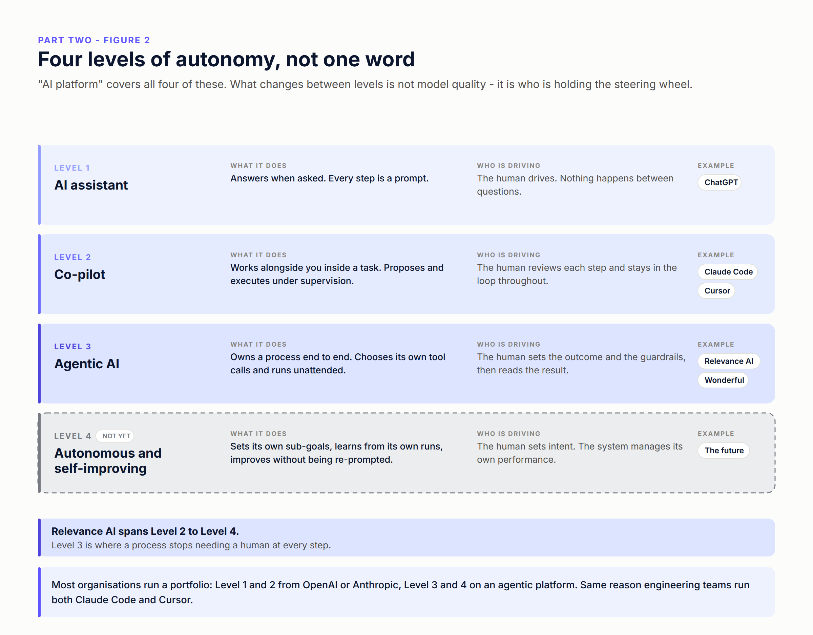
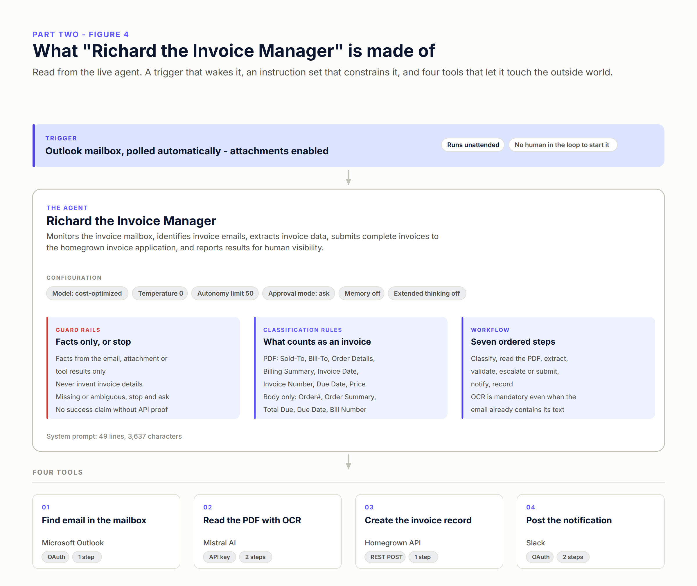
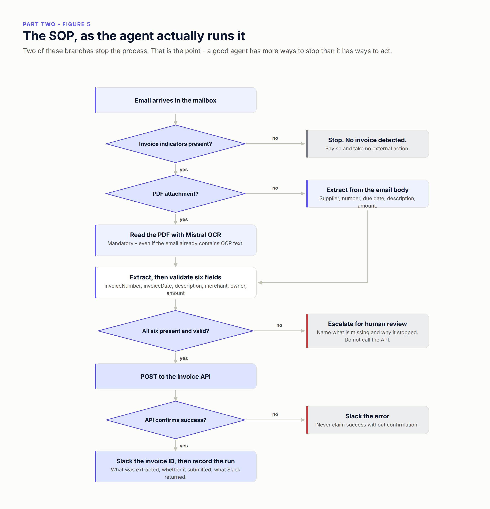
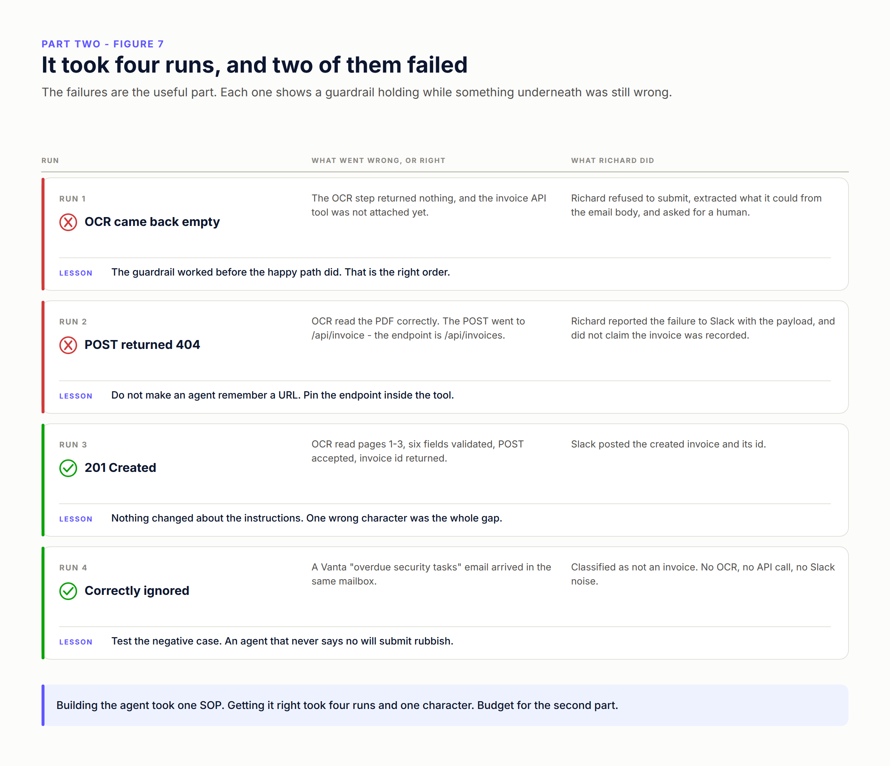
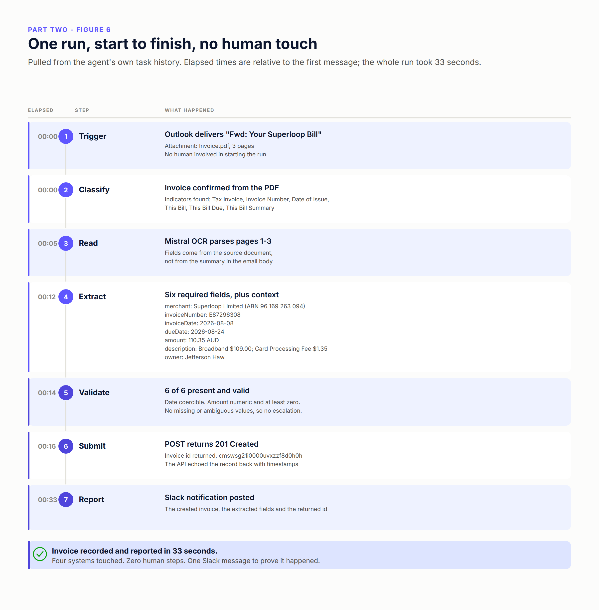

# Part Two — Building AI Agents within Relevance AI

> **Series:** [Relevance AI — Agentic AI Series](../README.md) · **Part 2 of 3 (so far)**
> **Reading time:** ~16 minutes · **Level:** Beginner to intermediate
> **Previous:** [Part One — What makes a use case good for Agentic AI](../Part%20One%20-%20What%20makes%20a%20use%20case%20good%20for%20Agentic%20AI/)

---

## The 90-second version

- Part One got you a use case with **quantity** (volume) and **quality** (a measurable outcome). Part Two is the next decision: **which platform you build it on**.
- The market sells AI with one paintbrush. There are really three shapes: **point solutions**, **embedded AI**, and **horizontal platforms** — and they fail in different places.
- Inside the horizontal layer there are **four levels of autonomy**: assistant, co-pilot, agentic, and autonomous/self-improving. Most organisations end up running a portfolio across levels, and that is normal rather than indecisive.
- Relevance AI's bet is **platform-centric**: give the subject matter expert the tools to build their own agent, and make IT's job onboarding the systems rather than writing the automation.
- **Context comes before agents.** Connect the systems first. For this invoice use case that is four of them: the mailbox, an OCR model, the homegrown invoice app, and Slack.
- Then the build input is a single **SOP**. I gave Relevance AI one document and it produced "Richard the Invoice Manager".
- Getting it right took **four runs, and two of them failed** — which is the most useful part of this article.

---

## Part One picked the use case. Now pick the platform.

[Part One](../Part%20One%20-%20What%20makes%20a%20use%20case%20good%20for%20Agentic%20AI/) was about choosing something worth building: enough volume for the payback to arrive, a documented process, owners in place, reachable context, and a metric someone already reports.

Say you did that. You have a use case with quantity and quality. The very next question — and the one I get asked before anyone asks me about prompts — is *what do we build it on?*

That question is harder than it should be, because the market describes wildly different products with the same three words.

---

## The market sells AI with one paintbrush

**Point solutions** solve one specific problem, very deeply, usually for one industry. Heidi Health doing clinical documentation for healthcare is a good example. If your use case is exactly the one it was built for, nothing horizontal will match its depth, and nothing will get you to value faster. Where it runs out is the second use case. And the third. Each one is another vendor, another contract, another integration, another login.

**Embedded AI** ships inside products you already own — Notion agents, the copilot in your CRM, suggest-reply in your helpdesk. There is no procurement and no onboarding, and the context is already sitting in the product, which is a real advantage that people under-rate. Where it runs out is the boundary of that product. Embedded AI can only see its own data. Anything that crosses systems — and most genuinely valuable work crosses systems — is out of scope by design.

**Horizontal platforms** are a platform you build on rather than a feature you switch on: Relevance AI, Wonderful, Anthropic, OpenAI. One platform, many use cases, many departments, and work that spans four systems is the normal case rather than the exception. Where it runs out is depth on a single vertical job, and the fact that it asks you to build something.

The honest answer is that most organisations end up with all three. The useful question is not which one wins. It is **which layer owns which use case**.

---

## Four levels of autonomy, not one word

Even inside the horizontal layer, "AI platform" covers four quite different things. What changes between them is not model quality. It is who is holding the steering wheel.

**Level 1 — AI assistant.** Answers when asked. Every step is a prompt. ChatGPT is the obvious example. The human drives, and nothing happens between questions.

**Level 2 — Co-pilot.** Works alongside you inside a task, proposing and executing under supervision. Claude Code and Cursor sit here. The human reviews each step and stays in the loop throughout.

**Level 3 — Agentic AI.** Owns a process end to end. Chooses its own tool calls. Runs unattended. The human sets the outcome and the guardrails, then reads the result. This is where Relevance AI and Wonderful operate, and it is the level where a process stops needing a human at every step.

**Level 4 — Autonomous, self-learning and self-improving.** Sets its own sub-goals, learns from its own runs, improves without being re-prompted. This is the future, and anyone telling you they ship it today is selling you Level 3 with better marketing.

Relevance AI spans Level 2 to Level 4.

Here is the part that trips up platform decisions: **depending on your AI maturity, you will end up evaluating and running more than one platform.** That is already common practice. Plenty of organisations run OpenAI or Anthropic for their Level 1 and 2 needs, and something like Relevance AI for Level 3 and 4. It is the same reason engineering teams happily run both Claude Code and Cursor. Nobody thinks that is a failure to decide. It is a portfolio matched to the job.

---

## Why "platform-centric" changes who builds

For the rest of this article I will use Relevance AI, because it is what I work with and because the invoice use case below is a real thing I built.

The part of Relevance AI's approach that matters most in practice is not a model choice. It is **who is allowed to build**.

The platform gives subject matter experts the tools and capabilities to build agents themselves. IT's role shifts to facilitating: onboarding the systems the organisation already uses, through pre-built connectors, and then getting out of the way. That means different business units inside the same organisation can build their own agents and workforces for their own use cases, on shared plumbing, and those agents can act as part of the company's operating system rather than as a side project.

This matters because the bottleneck in agentic AI is almost never the model. It is the distance between the person who understands the process and the person allowed to automate it. Every hop across that gap loses detail.

---

## Context first. Agents second.

Before you build any agent, Relevance AI needs the **context** the use case depends on. Context here means two things: **system integrations**, and the **knowledge or information you already maintain**.

So the first real step is connecting your systems of record through pre-built integrations.

The use case I will use here is deliberately unglamorous: automating the invoices an organisation receives from multiple suppliers. Classify whether an inbound email is invoice-related; if it is, extract the invoice data from the email or its PDF attachment; then lodge an entry in the invoice management system — which, in this case, is homegrown.

Four systems:

1. **Where the invoice comes from** — the email platform. Here, Microsoft Outlook, polled automatically with attachments enabled.
2. **A model that can read a PDF** — Mistral AI, for OCR.
3. **Where the invoice entry is lodged** — the homegrown invoice application, over its REST API.
4. **Notification of what happened** — Slack.

All four are supported, which is the point of the exercise: onboarding took minutes rather than a project. Three of them are pre-built connectors — Outlook and Slack over OAuth, Mistral with an API key. The homegrown invoice app has no connector and does not need one; a single-step API tool that POSTs a JSON body is enough.

**IT's job here is to authorise the connection, once.** Approve the OAuth grant, hold the API key, confirm the endpoint is reachable. **Everything after that is the subject matter expert's job** — writing the SOP, building the agent, testing it, iterating it. The person who understands invoices should own the invoice agent.

---

## The build input is an SOP

With context in place, building the agent uses Relevance AI's **Invent** capability, and the only thing you have to supply is a **Standard Operating Procedure**.

Not a prompt. Not a flowchart in a tool nobody else opens. An SOP — the same document you would hand a new starter.

Here is the one I used: **[Invoice Router Workforce SOP](https://docs.google.com/document/d/1fWO_nNq-v7AqLl9a70mQAQOpShTKPQpEifhVUFgnUxk/edit?usp=sharing)**.

This is where Part One earns its keep. "A documented process" was one of the five gates, and this is the concrete reason: **the SOP is the build input.** If it does not exist, you are not blocked on the platform — you are blocked on knowing what the process is. Writing it down is the work, and it was always the work.

A good SOP for this purpose names five things:

- **The role and the boundary** — who the agent is and what it must never do.
- **The classification rule** — how to tell a relevant input from an irrelevant one, in specific terms.
- **The ordered steps** — what happens, in what sequence, and what is mandatory.
- **The required output** — the exact fields the destination system needs, and what makes each one valid.
- **The escalation rule** — what "I am not sure" looks like, and who hears about it.

Miss the last one and you get an agent that guesses instead of asking.

---

## What Invent produced: "Richard the Invoice Manager"

Everything below is read from the live agent, not from my notes.

**Identity.** Richard the Invoice Manager, acting for StrideSolution, a fictional B2B SaaS company. Its stated job: monitor the invoice mailbox, identify invoice emails, extract invoice data, submit complete invoices to the homegrown invoice application, and report results for human visibility.

**Configuration.** A cost-optimised model at temperature 0 — this is extraction and validation work, not writing, so determinism is the point. Autonomy limit 50 with approval mode set to ask, so the agent has room to run a multi-step process but there is a ceiling. Memory off and extended thinking off, both correct here: every run is independent, and nothing about the task benefits from the agent remembering the last invoice.

**Trigger.** The Outlook mailbox, polled automatically, attachments enabled. No human starts a run.

**Instruction set** — 49 lines, about 3,600 characters, in three parts.

The **guardrails** come first, and they are the reason I trust this thing at all:

- Use only facts from the email, its attachment, or tool results.
- Never invent invoice details, and never create an invoice from an unsupported assumption.
- If required information is missing or ambiguous, stop and request human review — stating exactly what is missing and why processing paused.
- Never claim success unless the API response confirms it.

The **classification rules** are refreshingly unsubtle. A PDF counts as an invoice when it contains one or more of: Sold-To, Bill-To, Order Details, Billing Summary, Invoice Date, Invoice Number, Due Date, or Price. An email with no attachment counts when the body contains Order#, Order Summary, Total Due, Due Date, or Bill Number. Anything else is ignored and never submitted.

Notice what that is *not*. It is not "use your judgement about whether this looks like an invoice." Vague classification is where agents get expensive.

The **workflow** is seven ordered steps: classify, read the PDF, extract, validate, escalate or submit, notify, record. One instruction in there does more work than the rest combined — **the OCR call is mandatory, even when the email already contains OCR text or a summary of extracted fields**. That single line stops the agent from trusting a convenient summary over the source document.

**Four tools**, each doing one job:

- **Find email in the mailbox** — Outlook, over OAuth, one step. Built by Invent.
- **Read the PDF with OCR** — Mistral, API key, two steps: pick the document URL, then run OCR.
- **Create the invoice record** — the homegrown API, one step, a POST with a JSON body.
- **Post the notification** — Slack, OAuth, two steps: compose the message with a small LLM call, then send it.

One honest observation about that last one: it is **reused from a different use case**. Its description still says it alerts a documentation team about unanswered customer questions, and its input schema still asks for an "alert type" with options like *Documentation Issue*. It works — Slack messages arrive — but it is the weakest component in the build, and I come back to it below.

Worth noting too: the SOP is titled "Invoice Router *Workforce*", but what this needs is **one agent**, not a workforce. One agent, one process, four tools. Multi-agent orchestration is a real answer to a real problem, and this is not that problem.

---

## What Richard actually does

Read that diagram and count the exits. There are five, and **two of them stop the process without touching anything**: "not an invoice, take no action", and "fields missing, escalate and do not call the API".

That ratio is the whole design. A good agent has more ways to stop than it has ways to act. If yours only has a happy path, you have not built an agent — you have built a pipeline that will eventually push something wrong into a system of record and be confident about it.

The validation gate is worth spelling out, because it is where "extraction" becomes "trustworthy". Before submission, six fields must be present and valid: `invoiceNumber`, `invoiceDate`, `description`, `merchant`, `owner`, `amount`. `invoiceDate` must be coercible to a date. `amount` must be numeric and at least zero. Text fields must be non-empty. And there is a nice specific rule in the SOP: if two or more fields are unavailable, pause for human review rather than substituting the due date for the invoice date. Someone thought about the failure mode where a plausible-looking guess quietly becomes a wrong record.

---

## Then you iterate. It took four runs.

Relevance AI built the agent from the SOP. It did not work first time, and I would be suspicious of anyone who tells you theirs did.

**Run 1 — the OCR came back empty.** The OCR step returned nothing, and at that point the invoice API tool was not attached to the agent yet. What Richard did with that: it extracted what it could from the email body, said plainly that OCR had failed, refused to submit, and asked for a human — while showing the exact payload it *would* have sent. The guardrail worked before the happy path did. That is the right order for things to start working in.

**Run 2 — a 404.** OCR read the PDF correctly this time. Validation passed. Then the POST went to `/api/invoice` when the endpoint is `/api/invoices`. The API returned a 404 HTML page. Richard did not interpret that as success: it reported the failure to Slack with the payload and the truncated response body, listed the likely causes, and explicitly said the invoice had **not** been recorded.

That failure is entirely my fault, and it is a design lesson worth more than the fix: **the endpoint URL was written in the system prompt.** The agent was being asked to remember a string. Pin it inside the tool instead, where it cannot be retyped.

**Run 3 — 201 Created.** Same instructions, correct path. Invoice created, id returned, Slack posted. Nothing about the agent's reasoning changed between run 2 and run 3. One character was the whole gap.

**Run 4 — the negative case.** A Vanta "overdue security tasks" email landed in the same mailbox. Richard classified it as not an invoice, ran no OCR, called no API, and posted no Slack noise. This run matters as much as run 3. An agent that never says no will eventually submit rubbish confidently, and you will not find out from the agent.

Test the negative case. Ideally, test it first.

---

## Testing it end to end

Here is the successful run, pulled from the agent's own task history.

A forwarded Superloop bill arrives in the mailbox with `Invoice.pdf` attached, three pages. Richard classifies it as an invoice on the strength of the PDF containing *Tax Invoice*, *Invoice Number*, *Date of Issue*, *This Bill*, *This Bill Due* and *This Bill Summary*. Mistral OCR parses all three pages, so the fields come from the source document rather than from the summary in the email body.

Extraction returns: merchant *Superloop Limited* (ABN 96 169 263 094), `invoiceNumber` *E87296308*, `invoiceDate` *2026-08-08*, `dueDate` *2026-08-24*, `amount` *110.35* AUD, a description built from the actual line items — *Broadband $109.00; Card Processing Fee $1.35* — and owner *Jefferson Haw*.

Validation: six of six present and valid. Date coercible, amount numeric and at least zero, no missing or ambiguous values, so no escalation.

The POST returns **201 Created** with invoice id `cmswsg21i0000uvxzzf8d0h0h`, and the API echoes the record back with timestamps. Richard posts the created invoice, the extracted fields and the returned id to Slack.

**Total: 33 seconds. Four systems touched. Zero human steps. One Slack message so a human can check.**

Two details in there matter more than the speed. First, the description came from the *line items* on the PDF, not from the total in the email — that is the mandatory-OCR instruction paying for itself. Second, the invoice id in the Slack message is what makes the run auditable. "The agent said it worked" is not evidence. "Here is the id the system of record returned" is.

---

## What I would do differently

Writing this up made four weaknesses obvious, and none of them are about the model.

**Pin the endpoint in the tool, not the prompt.** This caused run 2's 404. Any value the agent has to retype is a value the agent can get wrong. Configuration belongs in configuration.

**Purpose-build the Slack tool.** The one Richard uses came from a documentation-triage use case and still describes itself that way. Tool reuse across use cases is a genuine benefit of a platform-centric approach — but a tool whose schema describes a different job will nudge the agent into filling fields with the wrong thing. Reuse the *pattern*, not the mismatched tool.

**Make the notification confirmable.** That Slack tool's declared output references a step name that does not exist in it, so successful sends return an empty object. Slack messages arrive, but the agent gets nothing back it can assert on — which sits awkwardly beside a guardrail that says never claim success without confirmation. Every tool that matters should return something you can check.

**Do not trust a dev tunnel.** The homegrown API sat behind an ngrok tunnel, which is fine for a demo and a liability for anything else. Half of run 1's confusion traces back to a temporary endpoint.

---

## What to do this week

1. **Name your layer.** For the use case you picked in Part One, decide whether it wants a point solution, an embedded feature, or a horizontal platform. Write the reason down in one sentence.
2. **Name your level.** Is the thing you want actually Level 3, or is it a Level 2 co-pilot with ambitions? Both are fine. Confusing them is not.
3. **List the systems** the use case touches — source, reasoning, system of record, notification. Check which have pre-built connectors and which need a small API tool.
4. **Get IT to authorise the connections.** One meeting, one grant per system. That is their whole part.
5. **Write the SOP.** Role and boundary, classification rule, ordered steps, required output fields, escalation rule. If you cannot write the classification rule in specifics, that is the finding.
6. **Build from the SOP, then break it on purpose.** Feed it a document with a missing field. Feed it something that is not an invoice at all. You are testing the guardrails, not the happy path.
7. **Only then run the happy path** — and check the destination system, not the agent's summary of itself.

---

## What's in this folder

- **`assets/`** — the seven figures above as PNG (used here, and sized for LinkedIn), plus the SVG sources and the script that generates them.
- **`linkedin.md`** — this article reshaped for the LinkedIn article editor, with image markers and publishing notes.

---

## Next up

→ [**Part Three — Fine Tuning & Iterating AI agents**](../Part%20Three%20-%20Fine%20Tuning%20&%20Iterating%20AI%20agents/): four runs got this agent working once. Making it reliable across hundreds of invoices is a different discipline — test sets, checks, and knowing when it is good enough to leave alone.

---

*The agent configuration, tool definitions and run traces in this article were read from a live Relevance AI project via the Relevance AI MCP server, then redacted for publication: the API endpoint host, OAuth account identifiers, Slack channel and workspace identifiers, mailbox addresses and signed attachment URLs have been removed or generalised. StrideSolution is a fictional company used for the demonstration. The Superloop bill is my own.*
